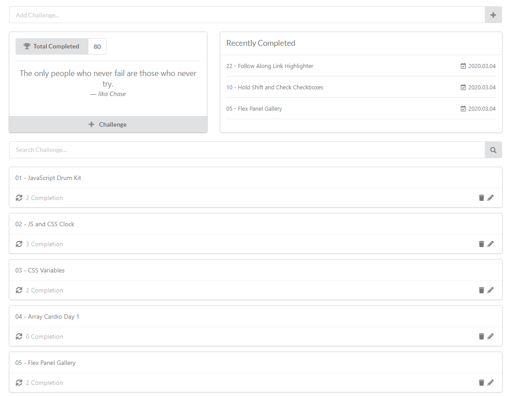

# randomChallengeGiver 
https://nlszekely.github.io/randomChallengeGiver/.

This is a responsive challenge giver application where you can give challenges to yourself and track your progress. 
Suitable for learning, especially when you want to repeat certain tasks until you get more comfortable with it.
I use it to give myself a random challenge every day from this free course https://javascript30.com.

Functions:
- add challenge
- edit challenge
- remove challenge
- get random challenge
- tracking completed challenges
- accept or refuse challenge

The data is stored in local storage.
